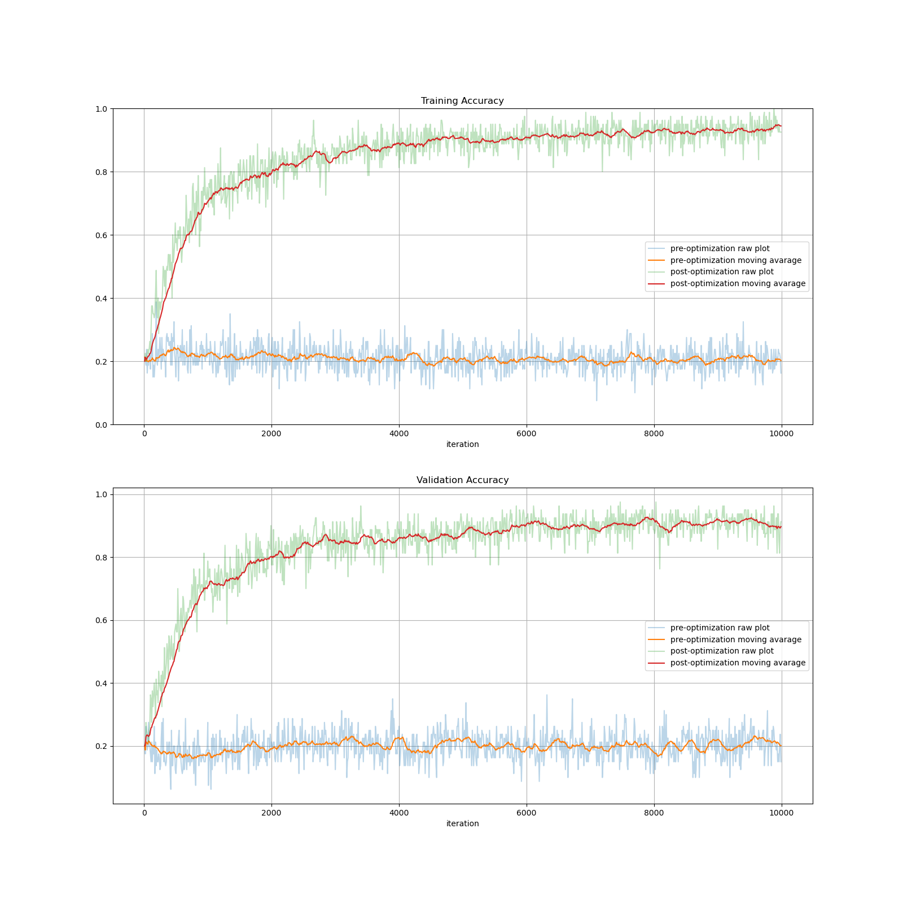

# Meta-Regularization by enforcing Mutual-Exclusiveness

## Setup Instructions  
 - To setup conda environment `conda env create -f conda_env.yml`  
 
### Omniglot Dataset  
 - To prepare non-mutual-exclusive dataset, use the script: `src/prepOmniglotDataset.py`.  

### Pose Dataset  
 - Copy the license text file `mjkey.txt` at `src/pose_data/`.  
 - Download CAD models from [Beyond PASCAL: A Benchmark for 3D Object Detection in the Wild](http://cvgl.stanford.edu/projects/pascal3d.html) PASCAL3D+_release1.1.  
 - Configure data path in the script `src/pose_data/convert_and_render.sh` and run this script. This will render the dataset using CAD models and save png files along with labels at configured directory. It will also generate `pickle` files of the dataset.      

## Experiments    

*Table I - Experiment Results*
| N-way | meta-train K-shot | meta-test K-shot | MAML Test Accuracy | MAML Accuracy StdDev |
|-------|-------------------|------------------|--------------------|----------------------|
| 10    | 1                 | 1                | 0.9130001          | 0.087736346          |
| 10    | 1                 | 10               | 0.9779833          | 0.024727175          |   

  
*Figure 1 - Training and Validation plot for 20-way, 1-shot, batch_size=16, mutual-exclusive*  

  
*Figure 2 - Training and Validation plot for 20-way, 1-shot, batch_size=16, non-mutual-exclusive*   

  
*Figure 3 - Training and Validation plot for 10-way, 1-shot, batch_size=16, mutual-exclusive*  

  
*Figure 4 - Training and Validation plot for 10-way, 1-shot, batch_size=16, non-mutual-exclusive*   

  
*Figure 5 - Training and Validation plot for 5-way, 1-shot, batch_size=16, mutual-exclusive*  

  
*Figure 6 - Training and Validation plot for 5-way, 1-shot, batch_size=16, non-mutual-exclusive*   