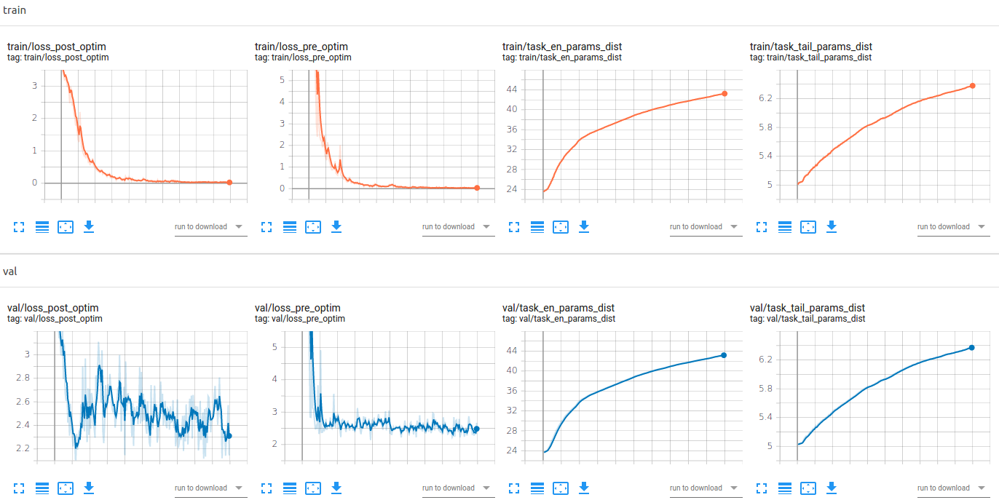
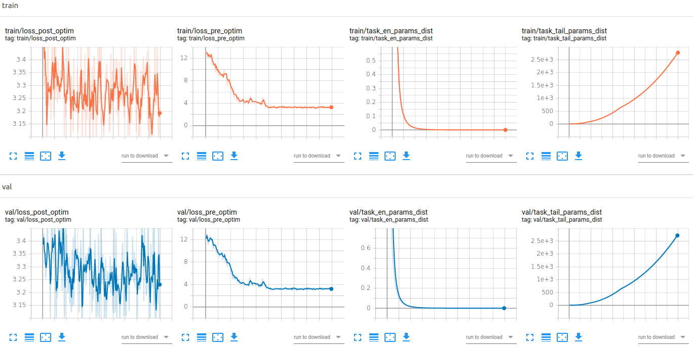
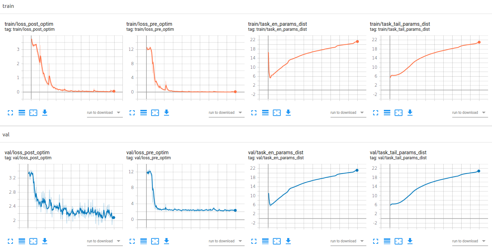

## No meta-regularization

```python train.py --dataset=pose --data_path=datasets/pascal3d_pose --meta_batch_size=10 --n_way=10 --k_shot=5 --meta_train_iterations=2000 --num_inner_updates=1 --meta_lr=0.001 --inner_update_lr=0.01 --learn_inner_update_lr```  

  
*Figure 1 - test results (2.4489813, 0.60921836, 0.5340034362293584)*  

## Minimize encoder distance and maximize tail distance  

```python train.py --dataset=pose --data_path=datasets/pascal3d_pose --meta_batch_size=10 --n_way=10 --k_shot=5 --meta_train_iterations=2000 --num_inner_updates=1 --meta_lr=0.001 --inner_update_lr=0.01 --learn_inner_update_lr --metareg```  

  
*Figure 2 - test results (3.2791924, 0.32184568, 0.2821101773644625)*  

## Enforce the ratio of encoder params and tail params between tasks to remain 1.0  

```python train.py --dataset=pose --data_path=datasets/pascal3d_pose --meta_batch_size=10 --n_way=10 --k_shot=5 --meta_train_iterations=2000 --num_inner_updates=1 --meta_lr=0.001 --inner_update_lr=0.01 --learn_inner_update_lr --metareg```  

  
*Figure 3 - test results (1.815596, 0.42753077, 0.3747472388484823)*  